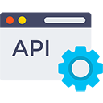

# ✨ Particle Network

## Overview


[README (1).md](<README (1).md>)



[security.md](overview/security.md)



[available-networks.md](overview/available-networks.md)



[get-started.md](getting-started/get-started.md)


## Platform-Specific Guides

|                                                                              🌍 Basic                                                                             |                                                                              📱 Mobile                                                                              |                                                                                                            🎮 Game                                                                                                            |
| :---------------------------------------------------------------------------------------------------------------------------------------------------------------: | :-----------------------------------------------------------------------------------------------------------------------------------------------------------------: | :---------------------------------------------------------------------------------------------------------------------------------------------------------------------------------------------------------------------------: |
|       

<a href="getting-started/platform-specific-guides/web.md">Web</a>
      |     

<a href="getting-started/platform-specific-guides/andriod.md">Andriod</a>
     |                                    

<a href="getting-started/platform-specific-guides/unity/">Unity</a>
                                    |
| 

<a href="getting-started/platform-specific-guides/server-api.md">Server API</a>
 |    

<a href="getting-started/platform-specific-guides/ios.md">iOS</a>
    | 

<a href="getting-started/platform-specific-guides/unreal.md">Unreal</a>
 |
|                                                                                                                                                                   |      

<a href="getting-started/platform-specific-guides/flutter.md">Flutter</a>
     |                                                                                                                                                                                                                               |
|                                                                                                                                                                   | 

<a href="getting-started/platform-specific-guides/react-native.md">React Native</a>
 |                                                                                                                                                                                                                               |

## Explore Our Services

<table data-view="cards"><thead><tr><th align="center"></th><th data-hidden data-card-cover data-type="files"></th><th data-hidden data-card-target data-type="content-ref"></th></tr></thead><tbody><tr><td align="center">🔌 The SSO for Web3</td><td><a href=".gitbook/assets/connect service.png">connect service.png</a></td><td><a href="developers/connect-service/">connect-service</a></td></tr><tr><td align="center">🗝 MPC-TSS based authentication</td><td><a href=".gitbook/assets/auth service.png">auth service.png</a></td><td><a href="developers/auth-service/">auth-service</a></td></tr><tr><td align="center">💰 Your one-stop wallet solution</td><td><a href=".gitbook/assets/wallet service.png">wallet service.png</a></td><td><a href="developers/wallet-service/">wallet-service</a></td></tr><tr><td align="center">💎 All-in-one NFT solution</td><td><a href=".gitbook/assets/nft service.png">nft service.png</a></td><td><a href="developers/nft-service/">nft-service</a></td></tr><tr><td align="center">🌐 Simplify scaling and powering your dApps</td><td><a href=".gitbook/assets/node service.png">node service.png</a></td><td><a href="developers/node-service/">node-service</a></td></tr></tbody></table>

## Resources

<table data-view="cards"><thead><tr><th align="center"></th></tr></thead><tbody><tr><td align="center">🗺️ Dashboard</td></tr><tr><td align="center">📚 Demo Applications</td></tr><tr><td align="center">❓FAQ  </td></tr><tr><td align="center">📰 Blogs</td></tr><tr><td align="center">🐙 Github</td></tr><tr><td align="center">📅 Book a demo</td></tr><tr><td align="center">🎮 Discord</td></tr><tr><td align="center">🐦 Twitter</td></tr><tr><td align="center">📊 System Status</td></tr></tbody></table>
