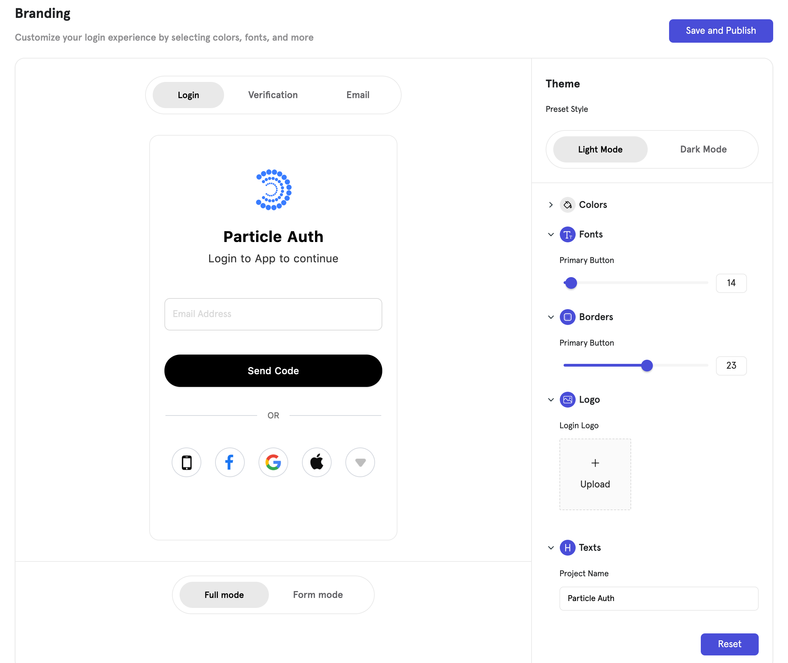

# After SDK Integrations

Data orientation is a necessary condition for a successful dApp. Therefore, Particle provides developers with some optimization ideas after accessing the SDK, hoping to help improve your dApp related data.

## Login Process

### Custom Auth UI

In Auth and verification emails, there are relevant elements of the company brand. You can set the Auth UI in "Branding" in Dashboard. These settings can be directly updated to the Auth UI without publishing a new version.&#x20;

You can also modify the icon in some special festivals to add some atmosphere.

👉[Auth Services-Branding](../auth-service/branding.md)

<figure><figcaption>
Branding
</figcaption></figure>

### Selection of login mode

You can adjust the order of login methods according to different devices or browsers.

In Android or Google browser, you can show “Google login” first. Your users only need to click the button to log in through Google account authorization. It can greatly improve the user's login experience.

Similarly, in iOS, we recommend using “Apple ID” to log in first.

## Wallet

### Custom Wallet UI

Particle supports custom Wallet UI.

1. You can only use the Particle APIs and design the Wallet UI by yourself.
2. Use the full UI provided in the Particle SDK. It is now supported to modify the Wallet UI by replacing the pictures in the SDK, to integrate the styles of Wallet and dApp better.

### Using Web Controls

Particle provides developers with several common control types that can be used directly.

#### Connect Wallet

Click to call up login directly. Support switching other blockchains.

<figure><figcaption></figcaption></figure>

#### Wallet hover icon

You can put it anywhere in the web page, click it and it will expand into a wallet. Users can use the full wallet function without jumping to the other page.

<figure><figcaption></figcaption></figure>

