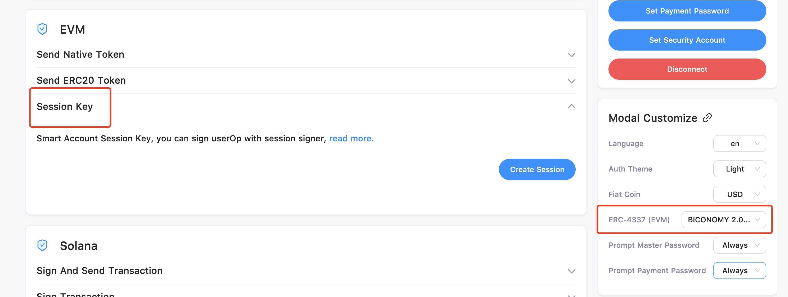

# Branding

You can customize your Auth UI (Light Mode/Dark Mode) and Code Email in Dashboard.

### Auth UI

Including the UI for Login and Verification

<figure><figcaption>
Branding - Login
</figcaption></figure>

#### Full Mode / Form Mode

Full Mode will display complete brand and more login methods.&#x20;

Form Mode will only support email login, and show a more concise UI.

<figure><figcaption>
Full Mode / Form Mode
</figcaption></figure>

#### Light Mode / Dark Mode

Light Mode / Dark Mode will be switched according to the user system.&#x20;

In the two modes, colors and logos need to be set separately; Fonts, Borders and Texts are universal.

<figure><figcaption>
Light Mode / Dark Mode
</figcaption></figure>

### Email

You can set the style of verification code mail, including its logo and project name in the title.

<figure><figcaption>
Branding - Email
</figcaption></figure>

### Save and Publish&#x20;

Click ”Save and Publish“ to save all settings and update the online Auth UI in real time.

### Reset&#x20;

After clicking, all styles will be reset to the original style.
