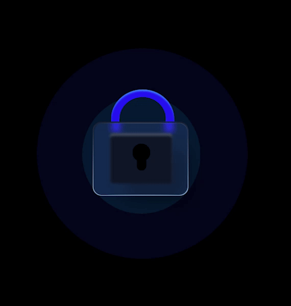

# Introduction

## What is Particle Auth？

Particle Auth is a simple self-custodial auth infra for Web3 apps and wallets. We support mobile number and email login, providing users with a simple operating experience. Their login account is then associated with a blockchain wallet, which is secured with a "Threshold Signatures vault".



## What does Particle Auth do? 

By integrating Particle Auth into your project, your users can experience the following services:

* **Email/Mobile number logins and passwordless flows**: users can register with a mobile phone number or email address, then log in using a verification code. This shortens the login process while maintaining a secure login.Now, we also provide mainstream social media logins for Web3 developers.
* **Provide MPC (Multi-Party Computation)-based threshold signatures:** With threshold signatures, each of the parties creates a key independently. Then, they forge the vault’s lock together, in a modular way, in which each party shapes a part of the lock that corresponds to its key.

## What Are Particle Auth's features?

* **Speedy logins**: the log-in process is no different from that of a Web2.0 login, which greatly lowers the barriers to entry and improves user experience.
* **Non-custodial private key infrastructure**: Particle Network provides MPC (Multi-Party Computation)-based TSS (Threshold Signatures Scheme). With TSS, each party creates an independent key. They then forge the vault's lock together in a modular way, in which each party shapes a part of the lock that corresponds to its key. The user is always in control of ownership and access to their cryptographic key pair.
* **Whitelabel:** customize Particle Auth's UI so that it blends directly into your application, you can brand in the Dashboard.
* **Signature**: a full signature service.

<figure><figcaption>
Transaction &#x26; Approve
</figcaption></figure>

## How Do I Integrate Particle Auth? 

Particle Auth comes with simple SDKs that can be integrated in multiple ways to provide the best experience for your users. We support all the available chains out there, with special providers available for EVM and Solana.

### 👉 [Auth SDKs](sdks/)

* 👉 [Server API](sdks/server-api.md)
* 👉 [Android](sdks/android.md)
* 👉 [iOS](sdks/ios.md)
* 👉 [Web](sdks/web.md)
* [👉 Unity](sdks/unity.md)
* 👉 Flutter: coming soon
