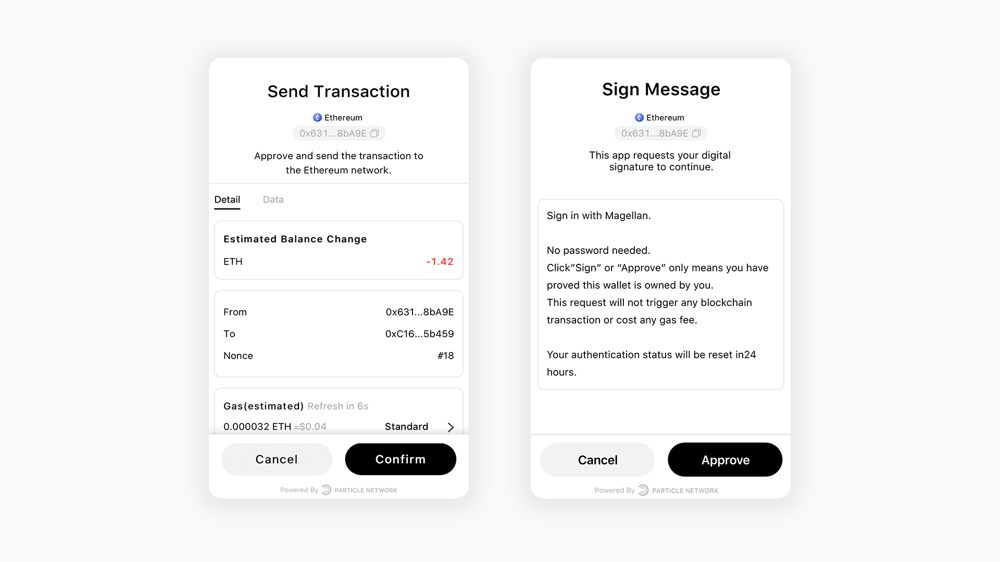

# Introduction

## What is Particle Auth？

Particle Auth is a simple self-custodial auth infra for Web3 apps and wallets. We support mobile number and email login, providing users with a simple operating experience. Their login account is then associated with a blockchain wallet, which is secured with a "Threshold Signatures vault".



## Why Particle Auth?&#x20;

Particle Auth is committed to helping Web2 users enter the Web3 world easily with their most familiar login methods.&#x20;

Users can login to your dApp through **Google, Apple ID, Facebook, Twitter and other social methods**, and can also login with **Email / Mobile number** without password.&#x20;

After the user successfully logs in, Particle Auth will automatically create a crypto wallet without a private key. The security is guaranteed by **MPC (Multi Party Computing) - based threshold signatures**, which is ahead of other technologies.

<figure><figcaption></figcaption></figure>

## What Are Particle Auth's features?

* **Speedy logins**: the log-in process is no different from that of a Web2.0 login, which greatly lowers the barriers to entry and improves user experience.
* **Non-custodial private key infrastructure**: Particle Network provides MPC (Multi-Party Computation)-based TSS (Threshold Signatures Scheme). With TSS, each party creates an independent key. They then forge the vault's lock together in a modular way, in which each party shapes a part of the lock that corresponds to its key. The user is always in control of ownership and access to their cryptographic key pair.
* **Custom UI:** customize Particle Auth's UI so that it blends directly into your application, you can brand in the Dashboard.
* **Signature Service**: a full signature service, including Send Transaction, Sign Message and so on. Your users can view the detailed data of each signature.

<figure><figcaption>
Transaction &#x26; Approve
</figcaption></figure>

## How Do I Integrate Particle Auth? 

Particle Auth comes with simple SDKs that can be integrated in multiple ways to provide the best experience for your users. We support all the available chains out there, with special providers available for EVM and Solana.

### 👉 [Auth SDKs](../connect-service/sdks/)

* 👉 [Server API](sdks/server-api.md)
* 👉 [Android](sdks/android.md)
* 👉 [iOS](sdks/ios.md)
* 👉 [Web](sdks/web.md)
* [👉 Unity](sdks/unity.md)
* 👉 [Flutter](sdks/flutter.md)
* 👉 [React Native](sdks/react-native.md)
