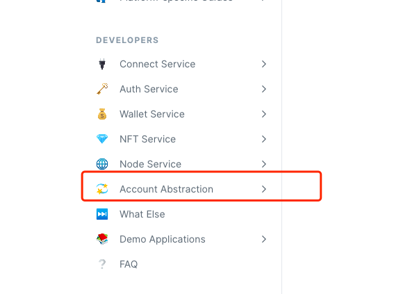

# Flutter

### 1.Add the Auth Service SDK to Your Flutter App <a href="#add-sdks" id="add-sdks"></a>

Run this command:With Flutter:

```dart
flutter pub add particle_auth
```

click [here](https://github.com/Particle-Network/particle-flutter/tree/master/particle-auth) to get the demo source code&#x20;

### 2.Configure Android project

open ${your flutter project} /android/app/build.gradle

2.1 add project config and update the minSdkVersion to 23

```groovy
//Modify these configurations
defaultConfig {
    // TODO: Specify your own unique Application ID (https://developer.android.com/studio/build/application-id.html).
    applicationId "com.example.particle_auth_test"
    // You can update the following values to match your application needs.
    // For more information, see: https://docs.flutter.dev/deployment/android#reviewing-the-build-configuration.
    minSdkVersion flutter.minSdkVersion
    targetSdkVersion flutter.targetSdkVersion
    versionCode flutterVersionCode.toInteger()
    versionName flutterVersionName
}

//After modification：
defaultConfig {
   // TODO: Specify your own unique Application ID (https://developer.android.com/studio/build/application-id.html).
   applicationId "com.example.particle_auth_test"
   // You can update the following values to match your application needs.
   // For more information, see: https://docs.flutter.dev/deployment/android#reviewing-the-build-configuration.
   minSdkVersion 23 // required by particle sdk
   targetSdkVersion flutter.targetSdkVersion
   versionCode flutterVersionCode.toInteger()
   versionName flutterVersionName

   //get from https://dashboard.particle.network/
   manifestPlaceholders["PN_PROJECT_ID"] = "772f7499-1d2e-40f4-8e2c-7b6dd47db9de" //your project id
   manifestPlaceholders["PN_PROJECT_CLIENT_KEY"] = "ctWeIc2UBA6sYTKJknT9cu9LBikF00fbk1vmQjsV" //your project client key
   manifestPlaceholders["PN_APP_ID"] = "01a23ce8-d2e9-4b37-9eab-bf477279e53e" //your app id
}
```

2.2 update Java Version to 11 and add dataBinding config

```groovy
//Modify these configurations
compileOptions {
  sourceCompatibility JavaVersion.VERSION_1_8
  targetCompatibility JavaVersion.VERSION_1_8
}

kotlinOptions {
  jvmTarget = '1.8'
}

//After modification：
compileOptions {
  sourceCompatibility JavaVersion.VERSION_11
  targetCompatibility JavaVersion.VERSION_11
}

kotlinOptions {
  jvmTarget = JavaVersion.VERSION_11
}

dataBinding {
  enabled = true
}
```

Now,Android configuration is complete!

### 3.Configure iOS project

### Prerequisites <a href="#prerequisites" id="prerequisites"></a>

* Install the following:
  * Xcode 13.3.1 \~ 13.4.1
* Make sure that your project meets the following requirements:
  * Your project must target these platform versions or later:
    * iOS 13


### Xcode 14

#### We have released new version for Xcode 14, if you want to develop with Xcode 14, you should specify version, for more versions information, please explore our github [auth](https://github.com/Particle-Network/particle-ios) page


3.1 After export iOS project, open Runner.xcworkspace under ios folder.



3.2 Create a **ParticleNetwork-Info.plist** into the root of your Xcode project

3.3 Copy the following text into this file:

```xml
<?xml version="1.0" encoding="UTF-8"?>
<!DOCTYPE plist PUBLIC "-//Apple//DTD PLIST 1.0//EN" "http://www.apple.com/DTDs/PropertyList-1.0.dtd">
<plist version="1.0">
<dict>
	<key>PROJECT_UUID</key>
	<string>YOUR_PROJECT_UUID</string>
	<key>PROJECT_CLIENT_KEY</key>
	<string>YOUR_PROJECT_CLIENT_KEY</string>
	<key>PROJECT_APP_UUID</key>
	<string>YOUR_PROJECT_APP_UUID</string>
</dict>
</plist>

```

3.4 Replace `YOUR_PROJECT_UUID`, `YOUR_PROJECT_CLIENT_KEY`, and `YOUR_PROJECT_APP_UUID` with the new values created in your Dashboard

3.5. Import the `ParticleAuthService` module in your `AppDelegate.swift` file.



```swift
import ParticleAuthService
```



```objectivec
@import ParticleAuthService;
```



3.6. Add the scheme URL handle in your app's `application(_:open:options:)` method



```swift
return ParticleAuthService.handleUrl(url)
```



```objectivec
return [ParticleAuthService handleUrl:url];
```



3.7. Configure your app scheme URL, select your app target in the info section, click to add the URL type, and pass your scheme in URL Schemes

Your scheme URL should be "pn" + your project app uuid.

For example, if your project app id is "63bfa427-cf5f-4742-9ff1-e8f5a1b9828f", your scheme URL is "pn63bfa427-cf5f-4742-9ff1-e8f5a1b9828f".

.png>)

### Initialize the SDK

1. **Before using the sdk you have to call init(Required)**&#x20;

<pre class="language-dart"><code class="lang-dart"><strong>ParticleAuth.init(SolanaChain.devnet(), env);</strong></code></pre>

### Login

```dart
List<SupportAuthType> supportAuthType = <SupportAuthType>[];
supportAuthType.add(SupportAuthType.all);
String result =await ParticleAuth.login(LoginType.phone, "", supportAuthType);
```

### Logout

```dart
String result = await ParticleAuth.logout();
debugPrint("logout: $result");
```

### GetAddress

```dart
final address = await ParticleAuth.getAddress();
print("getAddress: $address");
```

### SignMessage

```dart
 String result = await ParticleAuth.signMessage("Hello Particle");
 debugPrint("signMessage: $result");
```

### SignTransaction

```dart
ChainInfo currChainInfo = SolanaChain.devnet();
String? pubAddress = await ParticleAuth.getAddress();
if (currChainInfo is SolanaChain) {
  if (pubAddress == null) return;
  final trans = await TransactionMock.mockSolanaTransaction(pubAddress);
  String result = await ParticleAuth.signTransaction(trans);
  debugPrint("signTransaction: $result");
  showToast("signTransaction: $result");
} else {
  showToast('only solana chain support!');
}
```

### SignAllTransactions

```dart
ChainInfo currChainInfo = SolanaChain.devnet();
String? pubAddress = await ParticleAuth.getAddress();
if (currChainInfo is SolanaChain) {
  if (pubAddress == null) return;
  final trans1 = await TransactionMock.mockSolanaTransaction(pubAddress);
  final trans2 = await TransactionMock.mockSolanaTransaction(pubAddress);
  List<String> trans = <String>[];
  trans.add(trans1);
  trans.add(trans2);
  String result = await ParticleAuth.signAllTransactions(trans);
  debugPrint("signAllTransactions: $result");
  showToast("signAllTransactions: $result");
} else {
  showToast('only solana chain support!');
}
```

### SignAndSendTransaction

```dart
ChainInfo currChainInfo = SolanaChain.devnet();
String? pubAddress = await ParticleAuth.getAddress();
if (currChainInfo is SolanaChain) {
  final trans = await TransactionMock.mockSolanaTransaction(pubAddress);
  String result = await ParticleAuth.signAndSendTransaction(trans);
  debugPrint("signAndSendTransaction: $result");
  showToast("signAndSendTransaction: $result");
} else {
  final trans = await TransactionMock.mockEvmTransaction(pubAddress);
  String result = await ParticleAuth.signAndSendTransaction(trans);
  debugPrint("signAndSendTransaction: $result");
  showToast("signAndSendTransaction: $result");
}
```

### SignTypedData

You can get the demo source code from [here](https://github.com/Particle-Network/particle-flutter/blob/master/particle-auth/example/lib/auth\_demo/auth\_logic.dart)

```dart
ChainInfo currChainInfo = SolanaChain.devnet();
if (currChainInfo is SolanaChain) {
      showToast("only evm chain support!");
      return;
}
String typedData = '''[
  {
    "type":"string",
    "name":"Message",
    "value":"Hi, Alice!"
  },
  {
    "type":"uint32",
    "name":"A nunmber",
    "value":"1337"
  }
]''';
String result =
    await ParticleAuth.signTypedData(typedData, SignTypedDataVersion.v1);
debugPrint("signTypedData: $result");
```

### SetChainInfoASync

```dart
bool isSuccess = await ParticleAuth.setChainInfo(EthereumChain.goerli());
print("setChainInfo: $isSuccess");
```

### SetChainInfoSync

```dart
bool isSuccess = await ParticleAuth.setChainInfoAsync(SolanaChain.devnet());
print("setChainInfoAsync: $isSuccess");
```
