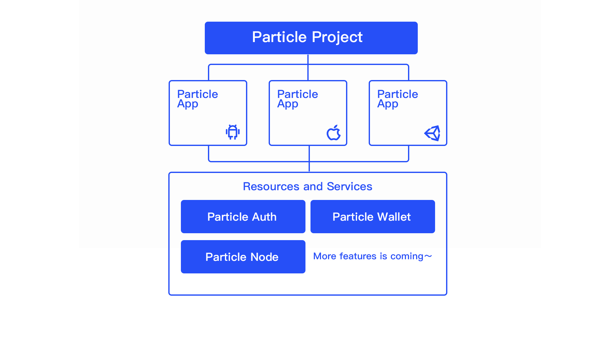

# Manage Projects

### The Relationship Between Projects and Apps

### Create Project

If you are new, Particle Network will automatically create a new project for you. You can click into **"First Project"** from the homepage to access the project overview.

If you want to create a new project, click on the **"Create"** button on the project creation page. Alternatively, you can select **"Add New Project"** when you view your **"All Projects"** list.

There is no need to specify your project's blockchain when you create a new project. This will all be specified once you use the SDK.

Once the project has been created successfully, you will receive an auto-generated Client Key, which acts as the project's unique identifier in Particle Dashboard. You will need to use this when initializing the Particle SDK in your app. Make sure you copy the Client Key correctly into your initial code.

After creating the project, you may subsequently add apps to it.

### Edit Project

After entering the project overview page, select **"Edit"** to edit the basic information of your project.

Currently, editable items include:

* Project name
* Delete project (once the project has been deleted, it cannot be retrieved—please proceed with caution)
