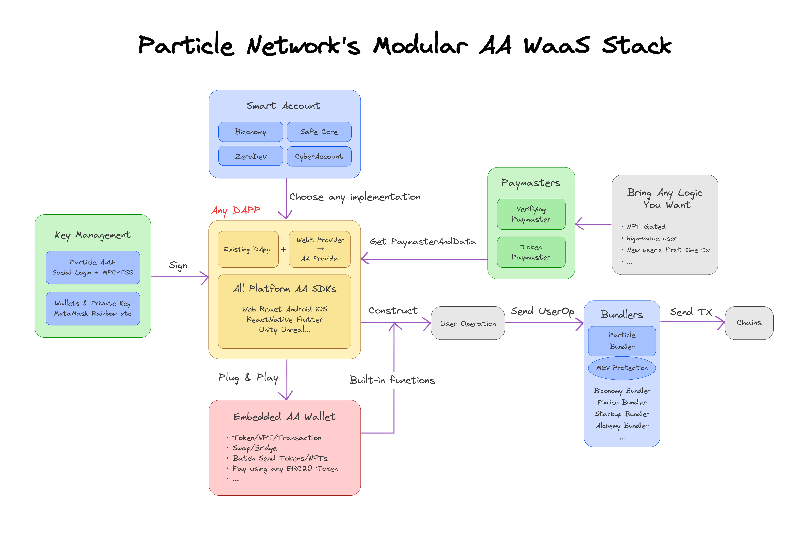

# 💫 Account Abstraction

<figure><figcaption>
Particle Netowork's Modular Smart Wallet-as-a-Service Architecture
</figcaption></figure>


[available-networks.md](available-networks.md)


## Features

1. Social Login by Particle Auth - MPC-TSS
2. Smart Wallet Lazy Deployment
3. Gasless Transactions: sponsor transactions as you wish
4. Pay Gas using any ERC-20 Tokens
5. Batch Transactions
6. Session Keys
7. ERC 6492
8.  Social Recovery

    ...

## Modular Components


[smart-account.md](smart-account.md)



[bundler.md](bundler.md)



[paymaster.md](paymaster.md)


## Try now

1. Go to [https://wallet.particle.network/](https://wallet.particle.network/)
2. Login: Use social accounts or any supported wallets
3. Go to **Setting** -> **Smart Account** -> Choose one **Smart Account**

## Demo Videos

1. Social Login & Batch Swap & USDC Pay Gas: [https://www.loom.com/share/fef39d36b0e44354a603010c8f987f7c](https://www.loom.com/share/fef39d36b0e44354a603010c8f987f7c)
2. Gasless Send NFT: [https://www.loom.com/share/599f85f5339346acb82b7ee5a5325a74](https://www.loom.com/share/599f85f5339346acb82b7ee5a5325a74)
3. Turn MetaMask to AA Wallet - Batch Swap & USDT Pay Gas: [https://www.loom.com/share/16c46ef473264b4683798783d9c16b3c](https://www.loom.com/share/16c46ef473264b4683798783d9c16b3c)
4. Buy NFT from OpenSea: [https://www.loom.com/share/3ff3db497c244e5e99db2b1448a86d16](https://www.loom.com/share/3ff3db497c244e5e99db2b1448a86d16)



## RPCs

### Bundler RPC

[Bundler RPCs](../node-service/evm-chains-api/bundler-rpc.md)

### High-level RPC

Latest: [Account Abstraction RPCs](../node-service/evm-chains-api/account-abstraction-rpc.md)

V1: [Particle x Biconomy RPCs ](../node-service/evm-chains-api/account-abstraction-rpc-v1.md)

## SDKs


[web.md](sdks/web.md)



[android.md](sdks/android.md)



[ios.md](sdks/ios.md)



[flutter.md](sdks/flutter.md)



[react-native.md](sdks/react-native.md)



[unity.md](sdks/unity.md)


Besides, we will release SDKs for Unreal, and more platforms soon!
