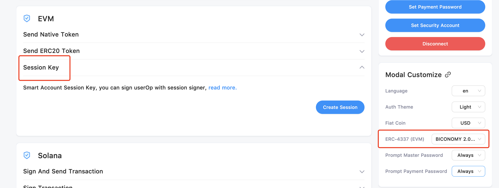

# Configure Your Contract

You can add a `contractURI` method to your ERC721 contract that returns a URL for the storefront-level metadata for your contract.

```solidity
contract MyCollectible is ERC721 {
    function contractURI() public view returns (string memory) {
        return "https://metadata-url.com/my-metadata";
    }
}
```

This URL should return some data in the following format:

```json
{
  "name": "Collection Name",
  "description": "Collection Description",
  "image": "external-link-url/image.png",
  "website_url": "website_url-url",
  "creator_fee_basis_points": 100,
  "creator_fee_recipient": "0xaC6A87c681A5Ed4cb58bC4fa7bF81a83b928C83C"
}
```

#### Contract metadata structure

* `name - (string,`` `**`required`**`)`: Name of Collection
* `description - (string)`: Description of Collection
* `image - (URL)`: Link to the collection's Logo
* `banner_url - (URL)`: Link to the collection's Banner
* `website_url - (URL)`: Link to The collection's official website
* `twitter_url - (URL)`: Link to The collection's official Twitter
* `discord_url - (URL)`: Link to The collection's official Discord
* `instagram_url - (URL)`: Link to The collection's official Instagram
* `item_width - (number)`: The width of the items in the collection
  * It needs to be set with **item\_height** to be displayed in the market in proportion to the item.
* `item_height - (number)`: The height of the items in the collection
  * It needs to be set with **item\_width** to be displayed in the market in proportion to the item.
* `creator_fee_basis_points - (number)`: A cut of every sale that the creator receives. The value ranges from 1 to 10000 (0.01% \~ 100.00%)
* creator\_fee\_recipient - (address): The address where the creator gets the cut
* custom\_currency - (address\[]): The ERC20 currency allowed to be used in this collection
  * If not set, only native currency is supported by default
  * The zero address represents the native token
  * For example, set up ETH and WETH under Ethereum Goerli
    * custom\_currency: \["0x0000000000000000000000000000000000000000", "0xB4FBF271143F4FBf7B91A5ded31805e42b2208d6"]
* custom\_sort - (string\[]): Custom sorting supported by this collection
  * For example
    * each NFT has a field whose type is number and called `rarity` in its metadata root
    * ```json
      // metadata
      {
          "name": "test",
          "attributes": [],
          "rarity": 1
      }
      ```
    * custom\_sort set to \["rarity"]
    * The market will support NFT ordering by rarity
    * 
  * **Limits**: The field value must be int64 and supports a maximum of three fields

