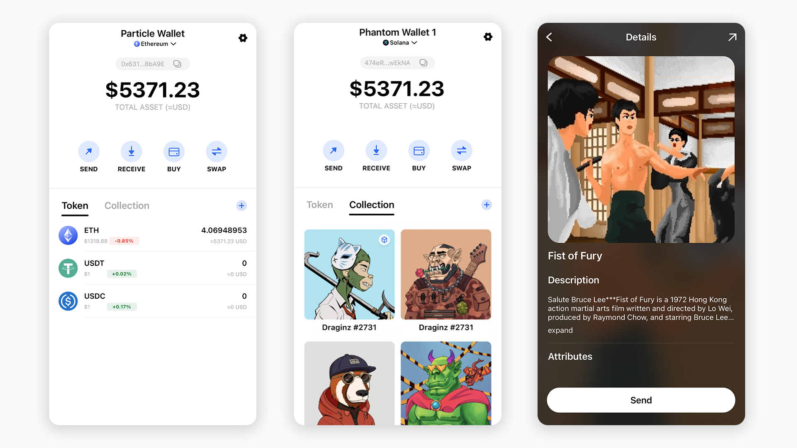

# 💰 Wallet Service

## What is Particle Wallet？

**The Particle Wallet** **is not an independent wallet—it is a wallet infrastructure plugged into apps or wallets.**

With Particle Wallet, you can integrate a wallet tailored to your app's needs, with features including transaction functions, NFT displays, and more.

<figure><figcaption>
Wallet
</figcaption></figure>

## Why Particle **Wallet**?

Using Particle Wallet, you have the flexibility to choose between building an app with an in-app wallet, or a standalone wallet itself. This has its advantages:

* **Rapid development**: we provide a complete wallet SDK with functions including transaction abilities, NFT displays and trading, signatures, etc. This reduces development time for you and ensures security for users.
* **A complete UI interface**: Particle Wallet provides a variety of highly adaptable UI interfaces for different app styles and scenarios.
* **Supports the use of independent functions**: to ensure the continuity of user experience, we support the utilization of a single function in a specific scenario. For example: to transfer funds, the user can call on a "transfer" page rather than having to enter the wallet.


Send & Receive



A beautiful home for your uses' NFTs



Swap with the best price


## How can I use Particle Wallet? 

Particle Wallet comes with simple SDKs that can be integrated in multiple ways to provide the best user experience. At present, it supports the display and trading of tokens/NFTs in the Solana and EVM ecosystems.

### 👉 [Wallet SDK](sdks/)

* 👉 [Android](sdks/android.md)
* 👉 [iOS](sdks/ios.md)
* 👉 [Web](sdks/web.md)
* [👉 Unity](sdks/unity.md)
* 👉 [Flutter](sdks/flutter.md)
* 👉 [React Native](sdks/react-native.md)
