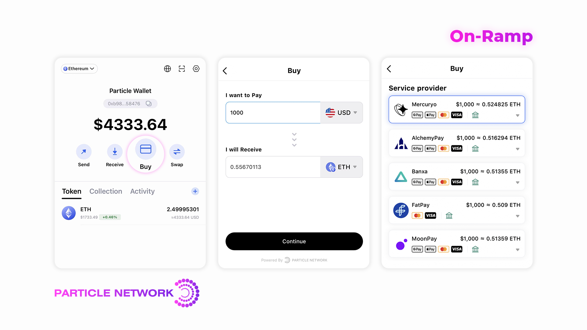

# On-Ramp

Particle has integrated multiple On-Ramp vendors, supporting dozens of fiat and various chains and cryptocurrencies.&#x20;

This lets our partners purchase cryptocurrency directly through various local and global fiat payment methods. This may be particularly useful for novice users who do not yet have any cryptocurrency holdings.

By allowing users to purchase cryptocurrency directly with fiat currency, exchanges, DeFi protocols, wallets, and Web3 services can more easily onboard new users into the crypto market and begin investing in digital assets.

### 👉[Supported fiat currencies](https://ramp.particle.network/supported\_fiat.html)

### 👉[Supported cryptocurrencies](https://ramp.particle.network/supported\_cryptocurrencies.html)

### Live

👉 [https://ramp.particle.network/](https://ramp.particle.network/)

👉 [https://wallet.particle.network/](https://wallet.particle.network/)\
\
👉 You can also enter the On-Ramp page by clicking the Buy button in the wallet.

<figure><figcaption></figcaption></figure>

## SDK Integration

You can customize the open buy page by setting `options` parameters.

<table><thead><tr><th width="180" align="center">name</th><th width="382" align="center">description</th><th width="91" align="center">type</th><th width="98" align="center">required</th></tr></thead><tbody><tr><td align="center">network</td><td align="center">[Solana, Ethereum, Binance Smart Chain,  Polygon, Tron, Optimism, Arbitrum One, Avalanche, zkSync Era, Celo]</td><td align="center">string</td><td align="center">False</td></tr><tr><td align="center">fiatCoin</td><td align="center">Fiat currency</td><td align="center">string</td><td align="center">False</td></tr><tr><td align="center">cryptoCoin</td><td align="center">crypto currency</td><td align="center">string</td><td align="center">False</td></tr><tr><td align="center">fiatAmt</td><td align="center">The amount of fiat currency that the user wants to spend.It's just for Buy Crypto</td><td align="center">number</td><td align="center">False</td></tr><tr><td align="center">cryptAmt</td><td align="center">The amount of crypto currency that the user wants to sell.It's just for Sell Crypto</td><td align="center">number</td><td align="center">False</td></tr><tr><td align="center">fixFiatCoin</td><td align="center">Prevent user from changing fiat currency</td><td align="center">bool</td><td align="center">False</td></tr><tr><td align="center">fixCryptoCoin</td><td align="center">Prevent user from changing fiat cryptocurrency</td><td align="center">bool</td><td align="center">False</td></tr><tr><td align="center">fixFiatAmt</td><td align="center">Prevent user from changing amount of fiat currency</td><td align="center">bool</td><td align="center">False</td></tr><tr><td align="center">walletAddress</td><td align="center">Wallet address for the predefined cryptocurrency</td><td align="center">string</td><td align="center">False</td></tr><tr><td align="center">theme</td><td align="center">light,dark</td><td align="center">string</td><td align="center">False</td></tr><tr><td align="center">language</td><td align="center">en,zh-CN,zh-TW,ja,ko</td><td align="center">string</td><td align="center">False</td></tr></tbody></table>

Integration can be achieved by using the API provided by different SDKs, or by splicing parameters according to your needs to obtain the corresponding link.
