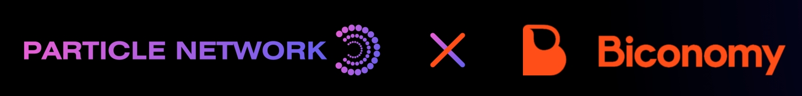

# 💫 Account Abstraction

<figure><figcaption>
<strong>Particle Network</strong> and <strong>Biconomy</strong>
</figcaption></figure>


[available-networks.md](account-abstraction/available-networks.md)


## Features

1. Social Login by Particle Auth - MPC-TSS
2. Smart Wallet Lazy Deployment
3. Gasless Transactions: sponsor transactions as your wish
4. Pay Gas using any ERC-20 Tokens
5. Batch Transactions
6. More features coming soon
   1. Session Keys
   2. ERC 6492
   3. Social Recovery
   4. ...

## Demo Videos

1. Social Login & Batch Swap & USDC Pay Gas: [https://www.loom.com/share/fef39d36b0e44354a603010c8f987f7c](https://www.loom.com/share/fef39d36b0e44354a603010c8f987f7c)
2. Gasless Send NFT: [https://www.loom.com/share/599f85f5339346acb82b7ee5a5325a74](https://www.loom.com/share/599f85f5339346acb82b7ee5a5325a74)
3. Turn MetaMask to AA Wallet - Batch Swap & USDT Pay Gas: [https://www.loom.com/share/16c46ef473264b4683798783d9c16b3c](https://www.loom.com/share/16c46ef473264b4683798783d9c16b3c)
4. Buy NFT from OpenSea: [https://www.loom.com/share/3ff3db497c244e5e99db2b1448a86d16](https://www.loom.com/share/3ff3db497c244e5e99db2b1448a86d16)

## RPCs

[Particle x Biconomy RPCs ](../developers/node-service/evm-chains-api/account-abstraction-rpc.md)

## SDKs


[web.md](../developers/account-abstraction/web.md)



[android.md](../developers/account-abstraction/android.md)



[ios.md](../developers/account-abstraction/ios.md)



[flutter.md](../developers/account-abstraction/flutter.md)


Besides, we will release SDKs for React Native, Unity, Unreal, and more platforms soon!
