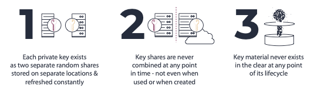
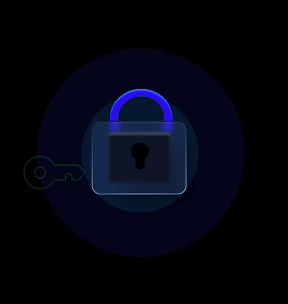

# Security

## Our Key Management Philosophy

Private keys are the most valuable possessions in the blockchain space. If the user loses their private keys or they are compromised, they will never recover their currencies. The most important part of designing and implementing Particle Network is the secure management of private keys.

To provide our extremely secure services, there are three fundamental points we insist on**:**

**No one, except the user themself, has full control**

Only the user can initiate the **** signing process. Other parties, including Particle Network and developers, can never access users' funds.

**Accounts need to be restored safely**

Users may delete their apps or lose their phones. We need to allow them to restore their account safely.

**No single point of failure**

With the traditional private key, if something happens to the key, users lose their crypto and can never get them back. We’ve replaced the traditional private key with two independently-created mathematical secret shares, thus eliminating the single point of failure.

## Our Next-Gen Key Management Architecture

**Particle Network** leverages secure multiparty computation (MPC) for the protection and management of cryptographic keys and secrets, providing industry-grade MPC-based solutions for key management and protection.

**Particle Network** provides the security benefits of having no single point of compromise and shared responsibility (like Multi-Sig), but with a single signature and without any dependency on the ledger. More specifically, it provides three critical security properties:

_**Sensitive keys and secrets are split into two random shares**_

The two shares are stored on separate, segregated parties. Each share reveals nothing about the key material.

_**All cryptographic operations performed throughout the key lifecycle are performed without ever combining these two shares together**._

This includes signing, derivation, and even generation. There is no complete key material or secret in the memory, ever. It is proven mathematically that obtaining the key material requires access to both key shares, and therefore requires compromising both parties. A single party, even if completely compromised and controlled by an attacker, reveals nothing about the key material—simply because the key material _never_ resides in any single party.

_**Key shares refresh**_

Key shares are continuously modified without modifying the key itself. It is computationally efficient and can be performed very frequently, thus forcing the attacker to compromise both parties at virtually the same time in order to obtain key material.

**Particle Network** includes a secure MPC implementation of the following algorithms:

1. 2-Party ECDSA - Solana
2. 2-Party EdDSA - Ethereum, Binance Smart Chain, Polygon, Avalanche, and more

As a result, Particle Network provides a **secure, easy-to-use, and trusted** key management system which is **chain agnostic, robust and non-custodial**.

## Threshold Signatures Explained

The Threshold Signature Scheme (TSS) is a cryptographic primitive for distributed key generation and signing. The use of TSS in Particle Network is a new paradigm that can provide numerous benefits, especially in terms of security.

Particle Network has two parties jointly computing the public key, each holding a secret share of the private key. The advantage is that the private key is not a single point of failure anymore because each party holds just one part of it. When signing transactions, we run a distributed signature generation between two parties. Only Party-1 (the user side) can start the signing process. Again, we've moved from local computation (single point of failure) to an interactive one.

**TSS vs. Multgisig**

TSS is using cryptography off-chain, while multisig occurs on-chain. **** The main point of difference is that multisig is blockchain-specific and needs to be reimplemented for every blockchain, and in some cases, is not supported at all. Conversely, TSS relies on pure cryptography, so support is always possible.

**TSS vs. Shamir secret sharing scheme**

The Shamir secret sharing scheme (SSSS) provides a way to store the private key in a distributed manner such that while the private key is at rest, it is stored in multiple locations. There are two differences between SSSS and TSS:

* Key Generation: in SSSS, there is a single party called “the dealer” that is in charge of generating the private key secret shares. It means that at the time of Key Generation, the private key is generated at a single location and then distributed by the dealer to different locations. In TSS, there is no dealer, as its role is distributed such that the full private key is never at a single location.
* Signing: in SSSS, the parties must reconstruct the full private key in order to sign, which results in a single point of failure each time a signature is needed. In TSS, the signing is done in a distributed way without ever reconstructing the secret shares.

As we can see, in TSS, the private key (which represents the security of the system) is never at a single location throughout its entire lifetime.

## Our Infrastructure Security Architecture

At Particle Network, we adopt the industry-best standard to implement our infrastructure. From public/private network segregation to intrusion detection monitoring, we ensure we spend time to construct and bootstrap the foundation of our infrastructure so that it is secure for our engineers to build on. We have:

**An End-to-end Encryption with TLS**

**A Trustee Particle Network TSS Party-2 Server**

**A Hardware Security Module**

****

:tada:****[**Now, start building your great dApp confidently on Particle Network!** ](auth-service/introduction.md):tada:****

## Further Reading

* [Fast Secure Two-Party ECDSA Signing](https://eprint.iacr.org/2017/552)
* [Fast Secure Multiparty ECDSA with Practical Distributed Key Generation and Applications to Cryptocurrency Custody](https://eprint.iacr.org/2018/987.pdf)
* [Two-Party ECDSA from Hash Proof Systems and Efficient Instantiations](https://eprint.iacr.org/2019/503.pdf)
* [Fast Multiparty Threshold ECDSA with Fast Trustless Setup](https://eprint.iacr.org/2019/114.pdf)
* [Secure Two-party Threshold ECDSA from ECDSA Assumptions](https://eprint.iacr.org/2018/499.pdf)

\
